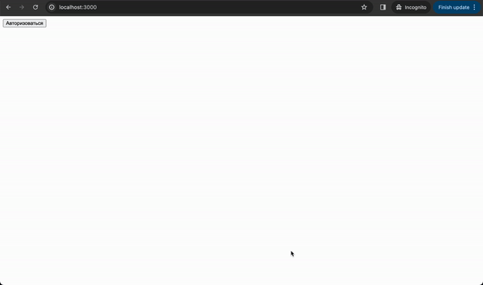

# Практика по тестированию

## Запуск
- Запуск `npm run start`
- Unit-тесты `npm run test:unit`
- UI-тесты `npm run test:ui` (возможно попросит установить playwright)
- UI-тесты с отчетом `npm run test:ui-report` (возможно попросит установить playwright)

## Функционал
- Пользователь заходит на страницу. Изначально он неавторизован. При нажатии на кноку `Авторизоваться` откроется модальное окно с формой логина.
- Когда пользователь авторизован, показывается надпись Вы авторизовны и есть кнопка `Выйти`
- Во время авторизации есть валидация при сабмите формы: email должен соответствовать регулярному выражению и пароль должен содержать в себе только цифры и быть не меньше 8 символов
- Для успешной авторизации используется tester@gmail.com/12345678

## Задание
- Написать unit-тесты на функции валидации (пример в `src/components/Login/helpers/validation/email`)
- Написать unit-тесты на хуки в папке hook
- Написать интеграционный тест на компонент Modal (пример в папке `/tests` и `/tests-examples`)
  - Проверить открытие/закрытие (клик на фон и клик на крестик)
- Написать UI тест на весь флоу авторизации

## Выполнение
- Сделать fork на github
- Написать тесты, делать все в разных коммитах
- При отправке на проверку написать все пользовательские сценарии текстом для удобства ревью